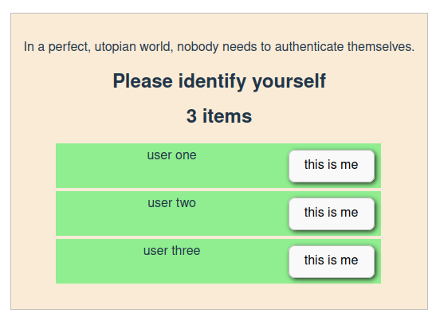

## experiment with websockets, react and nodejs

Components have a 'backing bean' on the server,
both are connected via websockets.
They can keep each other up to date on changes.

### 6 September 2024

Fixed some edge cases

### 29 Aug 2024

User first needs to identify himself over HTTP, then he can use the websockets server.
A token is used to identify the user. For demo purposes the token is just the user ID.
In a real world the user would be:

- required to provide credentials in an identify form
- the server would return a signed JWT token
- the server would verify the token on each request

# Run with

npm run server
npm run start

# Test and debug

The websocket server can be called command line with curl:

curl "http://localhost:8080/socket.io/?EIO=4&transport=polling" -v

# Screenshots

