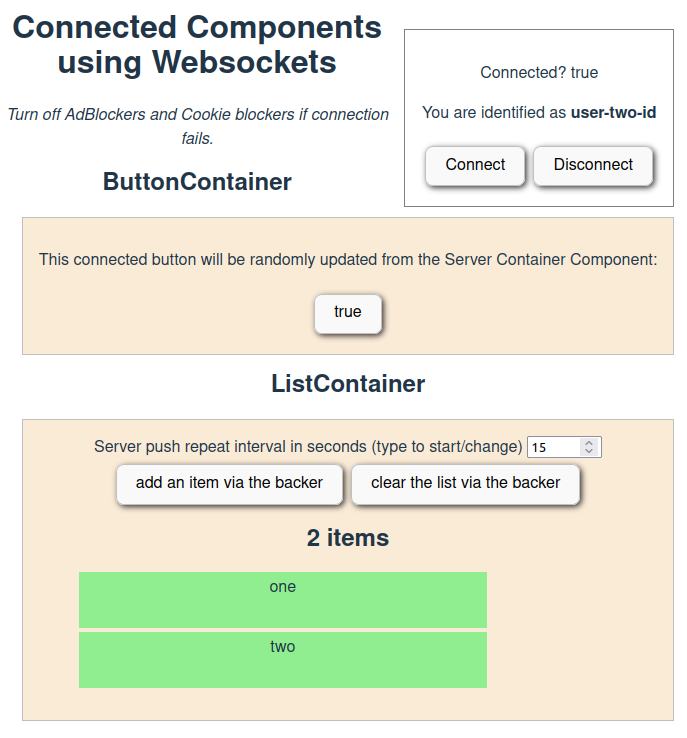

## experiment with websockets, react and nodejs

Components have a 'backing bean' on the server,
both are connected via websockets.
They can keep each other up to date on changes.

# Run with

npm run server
npm run start

# Test and debug

The websocket server can be called command line with curl:

curl "http://localhost:8080/socket.io/?EIO=4&transport=polling" -v

# Screenshot

